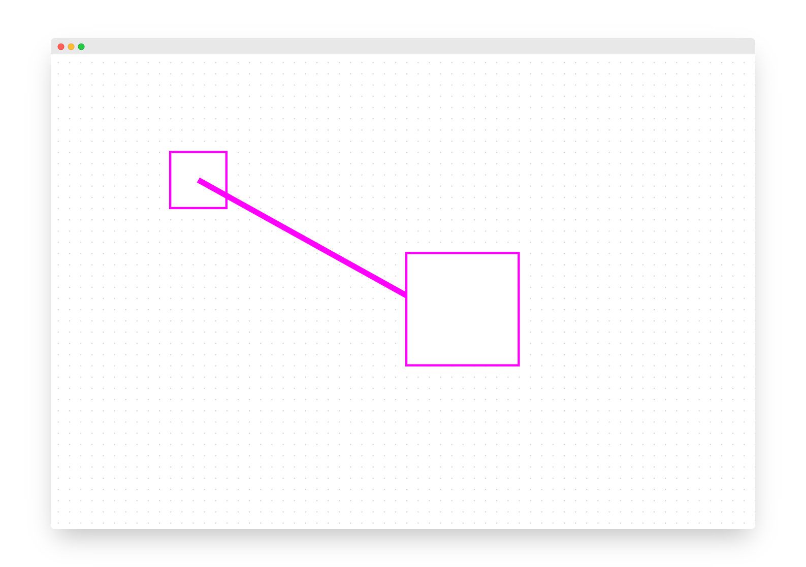

# diagram-js-grid

[](https://github.com/bpmn-io/diagram-js-grid/actions/workflows/CI.yml)

A minimal visual grid for [diagram-js](https://github.com/bpmn-io/diagram-js).




## Features

* Shows visual grid
* Supports modeler and viewer
* Hooks into `gridSnapping` activation


## Usage

Extend your diagram-js application with the grid module. We'll use [bpmn-js](https://github.com/bpmn-io/bpmn-js) as an example:

```javascript
import BpmnModeler from 'bpmn-js/lib/Modeler';

import gridModule from 'diagram-js-grid';

var bpmnModeler = new BpmnModeler({
  additionalModules: [
    gridModule
  ]
});
```


## License

MIT
